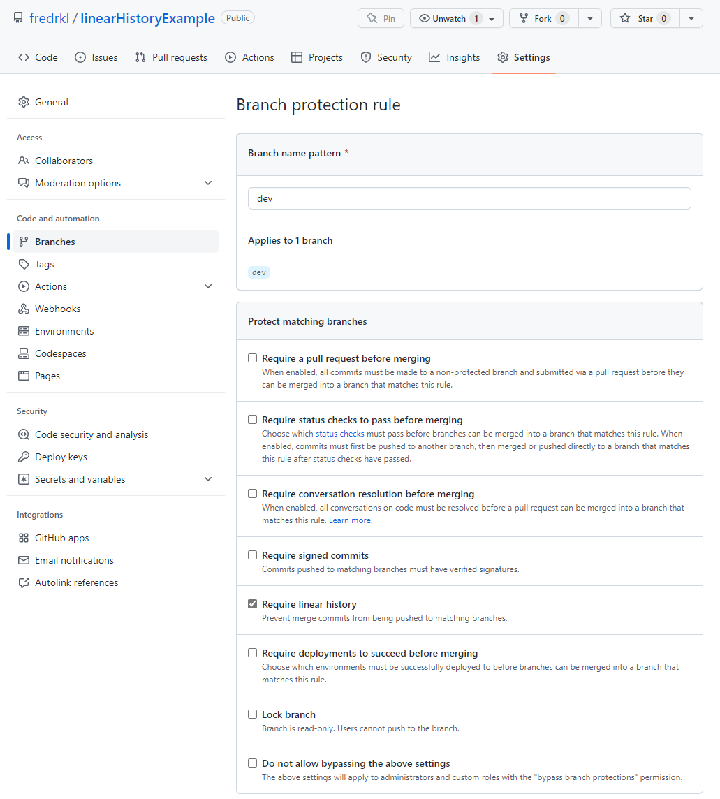

# Linear History Example

Example of force linear history setting in GitHub. In a GitOps setup, this is useful to prevent merge commits from being added to the history. This repo, therefore, has the setting _Require linear history_ enabled.

When you create a PR from lab to dev you will that dev is rebased on top of lab. This is because the setting _Require linear history_ is enabled.
